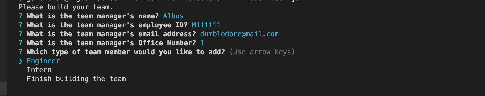
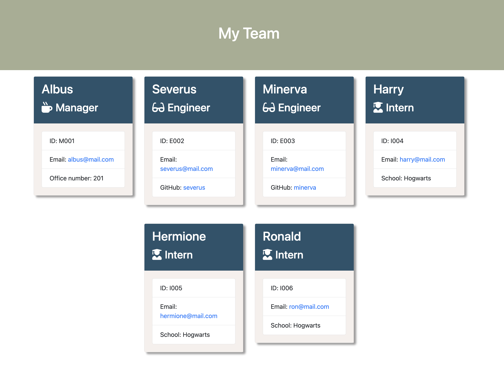

# Team-Profile-Generator

## Description

This is a command-lin application to generate a team profile HTML page.

The application takes from a user piece of information about employees on a software engineering team, then generates an HTML webpage that displays summaries for each person.

## Screenshot


<br>


## Table of Contents

**[User Story](#UserStory)**<br>

**[Built with](#BuiltWith)**<br>

**[Installation](#License)**<br>

**[Usage](#Usage)**<br>

**[Tests](#Tests)**<br>

**[Questions](#Questions)**<br>

## User Story

```
AS A manager
I WANT to generate a webpage that displays my team's basic info
SO THAT I have quick access to their emails and GitHub profiles
```

## Built with

- HTML
- CSS
- Javascript
- Node
- Inquirer
- Jest

## Installation

To install necessary dependencies, run the following command:

```
npm install
```

## Usage

To run this application and start generating a team page use the following command:

```
node index.js
```

## Tests

To run tests, run the following command:
​

```
npm test
```

## Questions

If you have any additional questions about this project, please open an issue or drop me a message at ofelczak@gmail.com.
Also, if you would like to have a look at other of my works, please check my repository's tab or click the following link to see more: https://github.com/OlgaFelczak.
